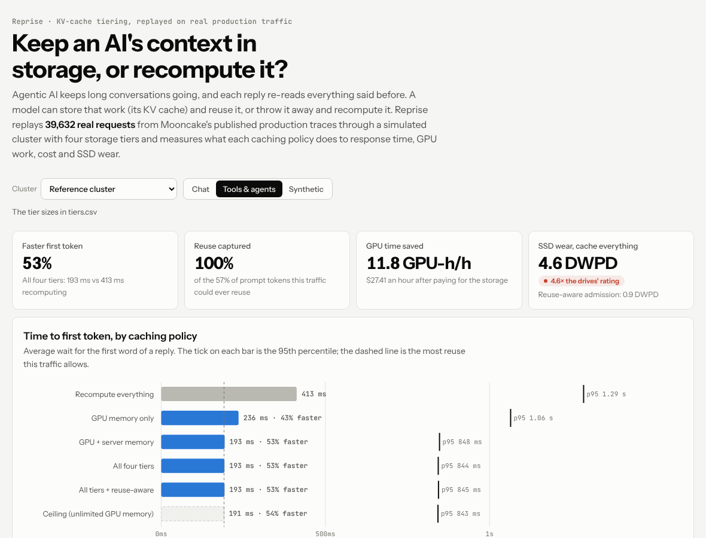

# Reprise

**Keep an AI model's context in storage, or recompute it?** Reprise replays 39,632 real requests from Mooncake's published production traces through a simulated GPU cluster with four storage tiers (GPU memory, server memory, NVMe SSD, hard drives). It measures what each caching policy does to time to first token, GPU work, cost and SSD wear.

It was built to test a claim from storage vendors (for example Seagate's piece on KV-cache offloading): agentic AI re-reads long context, so offloading the KV cache to SSD and hard drives, instead of regenerating it, frees the GPU and cuts latency. The claim is checked against real traffic rather than a benchmark.



## Findings (reference cluster unless stated)

| Workload | Recompute | GPU memory only | GPU + server memory | All four tiers | Possible reuse |
|---|---|---|---|---|---|
| Chat (12,031 requests, 1 hour) | 623 ms | 502 ms | 410 ms | 402 ms | 37% of prompt tokens |
| Tools & agents (23,608 requests, 1 hour) | 413 ms | 236 ms | 193 ms | 193 ms | 57% |
| Synthetic multi-turn (3,993 requests) | 819 ms | 460 ms | 282 ms | 282 ms | 65% |

*Mean time to first token.*

1. **The headline holds for reusable requests.** Requests whose prompt was 90 to 100% cached got their first token 94 to 97% faster than recomputing it. That is the like-for-like version of the "95% faster than regenerating" figure.
2. **Across all traffic the gain is real but smaller.** Average time to first token fell 35% for chat, 53% for tool and agent traffic and 66% for the synthetic set. Many prompts are new, and the possible reuse sets a ceiling.
3. **With ordinary memory, SSD and disk add little within an hour.** GPU plus server memory captures 96 to 100% of the possible reuse. The traces cover one hour, so they cannot show context that returns after days, which is where capacity tiers would earn their place.
4. **When memory is scarce, the SSD tier is what saves it.** In the memory-pressure scenario, memory alone gets 51% of the possible reuse on the chat trace, and adding SSD recovers 100%.
5. **Hard drives help only with enough bandwidth.** A 168 MB block (Llama 3.1 70B, FP16 KV) takes about 50 ms from a 4 GB/s-per-node drive pool. Recomputing it takes 20 to 25 ms, so the simulator recomputes instead. With four times as many drives striped behind each node, the hard-drive tier becomes worth reading.
6. **Caching everything on flash wears it out.** Writing every evicted block to SSD comes to about 4.7 drive-writes per day against a 1-DWPD rating. Writing only blocks that have already been reused cuts that to about 1.0 and keeps about 97% of the benefit.

## What is real and what is assumed

- **Real:** the requests. They are [Mooncake's FAST'25 trace release](https://github.com/kvcache-ai/Mooncake) (Apache-2.0), with arrival time, input and output token counts, and remapped hashes of each 512-token prefix block. There is no prompt text. `ingest/extract.py` checks the downloads against the request counts published with the release.
- **Assumed, all in `seeds/`:**
  - the model (Llama 3.1 70B; Mooncake's own model isn't public)
  - the cluster: 4 nodes of 8 × H100 at 45% prefill utilisation
  - every tier's size, bandwidth, latency, purchase price and endurance, each with a source note
  - the policies and scenarios

  Change a CSV and re-run to see what moves.
- **Left out:** queueing, decode, contention between concurrent requests, and overlapping loads with compute. Absolute times are indicative; the comparisons between policies are the point.

## How the simulator works

`sim/simulate.py` processes each trace in arrival order.

- **What can be reused:** a request can only reuse its longest run of leading blocks that are still cached somewhere, because each block's KV depends on everything before it.
- **Load or recompute:** each cached block is either loaded (latency + size ÷ bandwidth) or recomputed, whichever is faster. A slow tier is never forced.
- **Prefill cost:** prefill FLOPs = 2 × params × tokens + 2 × layers × hidden × (end² − start²).
- **After each request:** its blocks become most-recently-used in GPU memory. The tiers are exclusive LRU, and overflow cascades down to the next tier the policy allows, or is dropped. The reuse-aware policy only lets a block below server memory once it has been reused.
- **Ceiling:** unlimited GPU memory, the most reuse a trace allows.

## Pipeline

```
Mooncake traces ─ extract (counts + SHA-256) ─┐
                                              ├─ load_raw ─ DuckDB / Snowflake raw ─ dbt staging → core → reporting ─ dashboard
seeds/*.csv ─ simulate.py (126 runs) ─────────┘   (sim files hash-checked)
```

dbt runs 39 tests, among them:
- every block count matches its token count
- every input token is either reused or computed, exactly once
- every simulation replays every request in the trace's own order
- no policy beats the ceiling
- an independent SQL check that the simulator's prefill times match the FLOPs model

`sim/tests` has unit tests for the tier cache. CI reruns everything from a clean download on every push.

## Run it

```
pip install -r requirements.txt
make all            # extract, simulate, test, load, dbt build, export  (~2 minutes)
make serve          # dashboard at http://localhost:8000
```

On Snowflake (key-pair sign-in, database `REPRISE`):

```
python ingest/load_snowflake.py --duckdb warehouse/reprise.duckdb --database REPRISE --schemas raw_mooncake,raw_sim
dbt build --profiles-dir . --target snowflake
python dashboard/export_data.py --target snowflake
```
